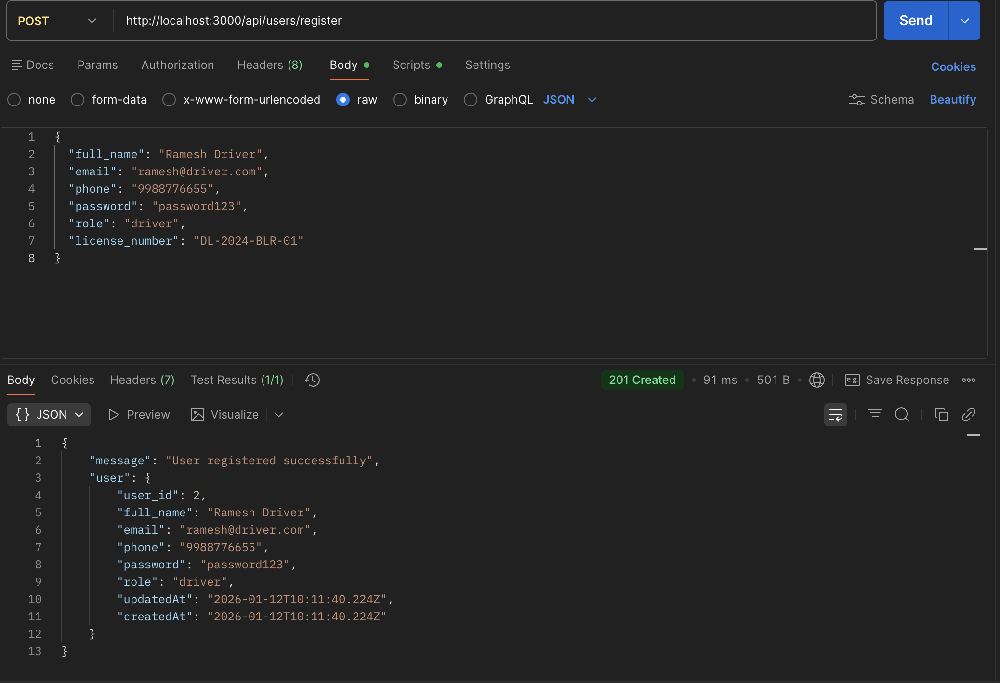
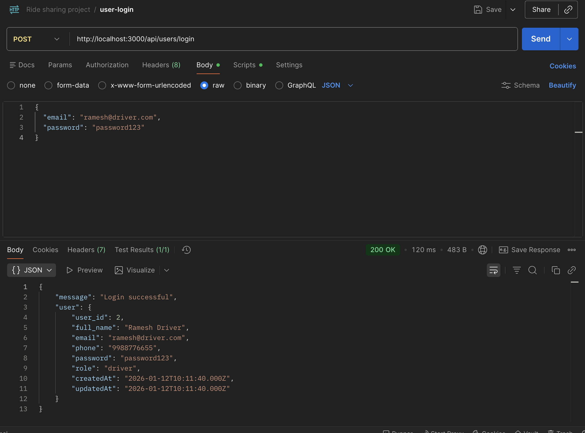
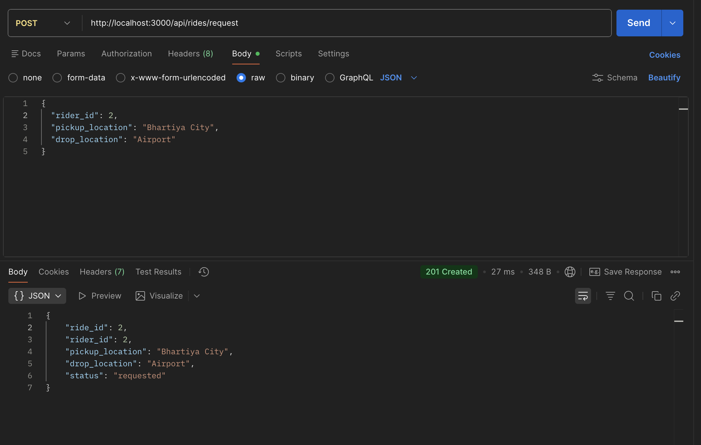
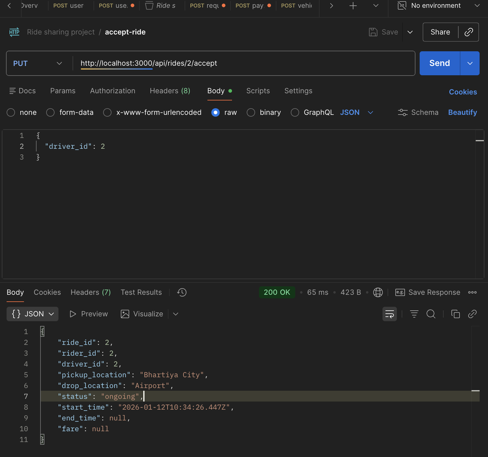
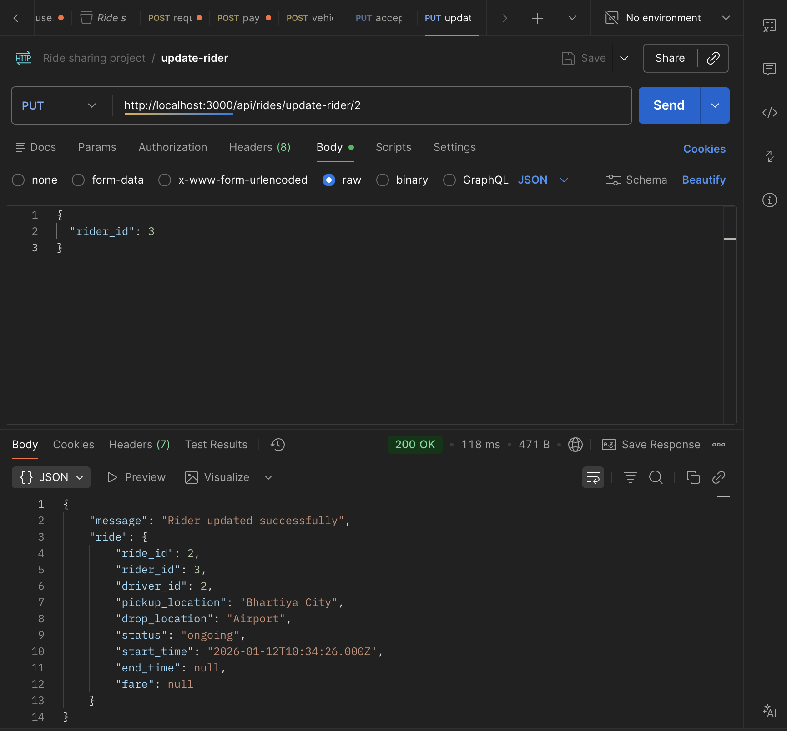
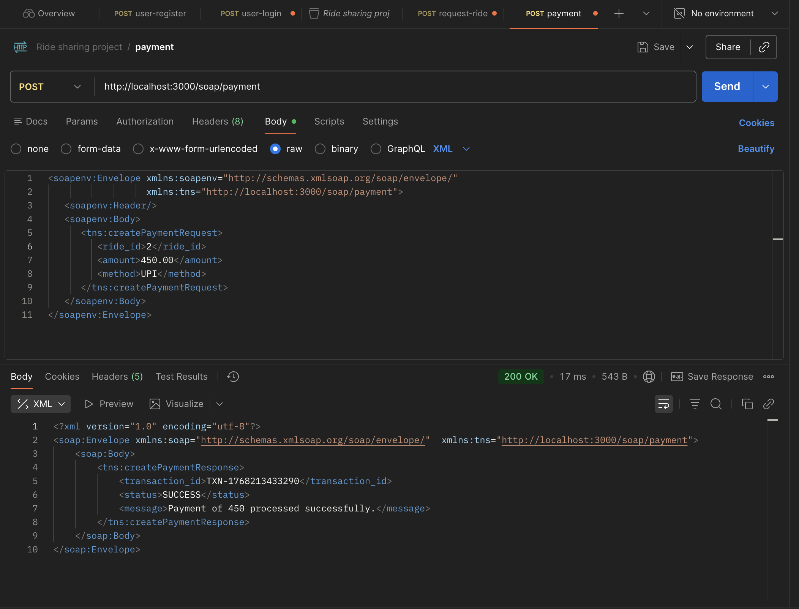
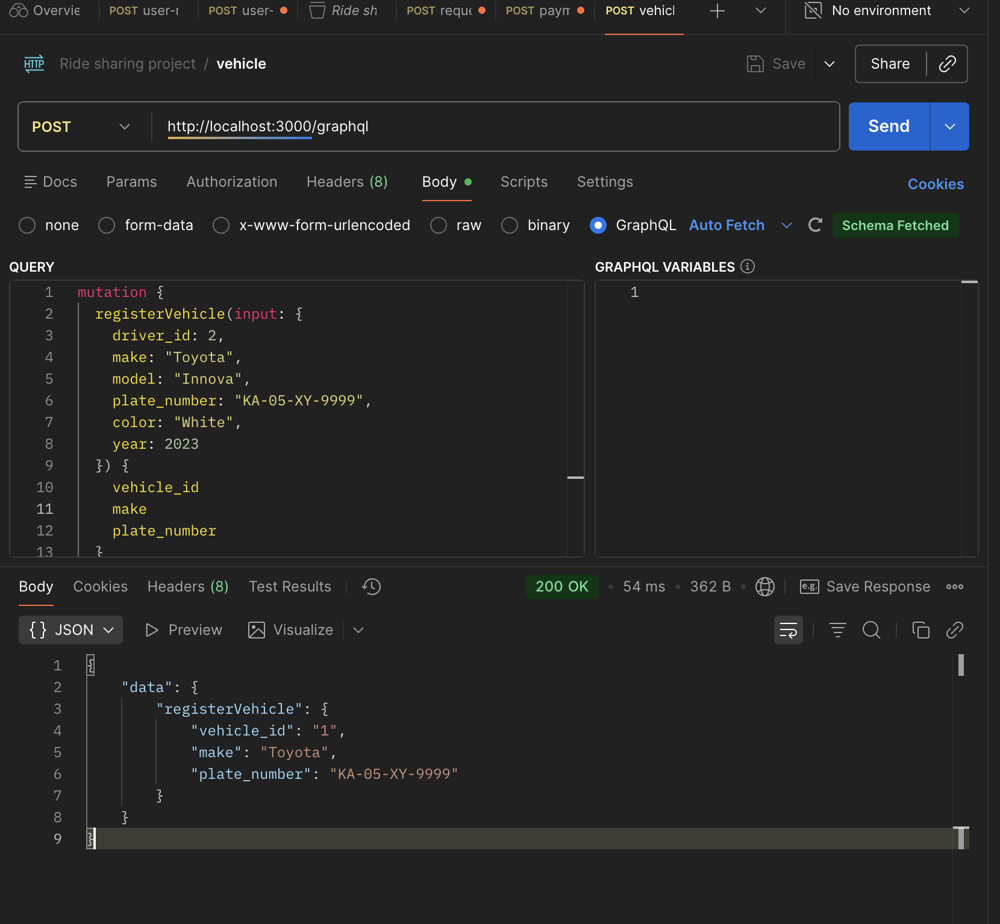
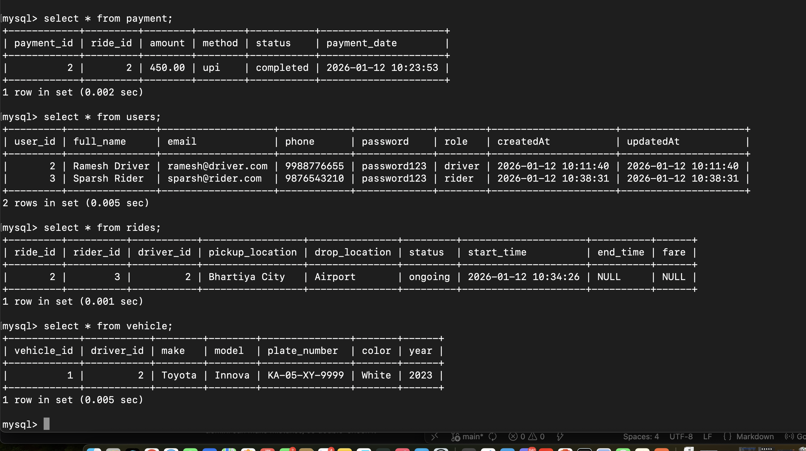

# 🚖 SwiftRide - Hybrid Ride Sharing Platform

A comprehensive full-stack ride-sharing application implementing a **Hybrid API Architecture**. This project demonstrates the integration of **REST**, **GraphQL**, and **SOAP** protocols into a single cohesive system with a modern real-time frontend.

---

## 🚀 Key Features

### **🗺️ Real-Time Mapping & Pricing**
* **OpenStreetMap Integration:** Utilizes **OpenStreetMap** APIs to calculate precise distances between pickup and drop locations.
* **Dynamic Fares:** Prices are calculated automatically based on real-world traffic distance.

### **👤 For Riders**
* **Request Rides:** Seamless booking with instant fare estimates.
* **Live Tracking:** Real-time status updates (Requested → Ongoing → Completed).
* **SOAP Payments:** Secure transaction processing via XML-based SOAP service.
* **GraphQL Ratings:** Rate drivers using GraphQL mutations.

### **🚗 For Drivers**
* **Marketplace View:** View **ALL** available ride requests in real-time.
* **Accept/Reject:** One-click acceptance of ride requests.
* **Vehicle Management:** Register and manage vehicles using **GraphQL**.
* **Ride Management:** Complete rides and manage earnings.

---

## 🛠️ Technical Architecture

| Component | Technology / Protocol | Usage |
| :--- | :--- | :--- |
| **User & Ride Mgmt** | **REST API** | Registration, Login, Ride Requests, Status Updates |
| **Vehicle & Ratings** | **GraphQL** | Registering cars, Fetching vehicle details, Rating system |
| **Payments** | **SOAP API** | Secure payment transaction processing (XML) |
| **Mapping** | **OpenStreetMap** | Geocoding and distance calculation |
| **Frontend** | **Vanilla JS/HTML5** | Async fetching, Dynamic DOM updates, Auto-refresh |

---

## 📸 API Workflows & Screenshots

### **1. User Management (REST)**
**User Registration & Login**
*(Endpoint: POST /api/users/register)*

### **2. Ride Operations (REST & OpenStreetMap)**
**Request Ride (With Real-Time Fare)**
*(Endpoint: POST /api/rides/request)*

**Accept Ride (Driver Dashboard)**
*(Endpoint: PUT /api/rides/accept/:id)*

**Update Rider Details**

### **3. Payment Gateway (SOAP)**
**Secure Payment Processing**
*(Endpoint: POST /soap/payment)*

### **4. Vehicle Management (GraphQL)**
**Vehicle Registration**
*(Mutation: registerVehicle)*

---

## 💾 Database Design
**Complete Schema Snapshot**

## 👥 Contributors

| Component | Developers |
| :--- | :--- |
| **REST API** | Diya Adhikary & Soumyata Sarkar |
| **SOAP API** | Adarsh Ranjan |
| **GraphQL** | Anamika Ghosh & Gyaneshwer Jha |

---
*Built with ❤️ for the Hybrid API Project Evaluation*